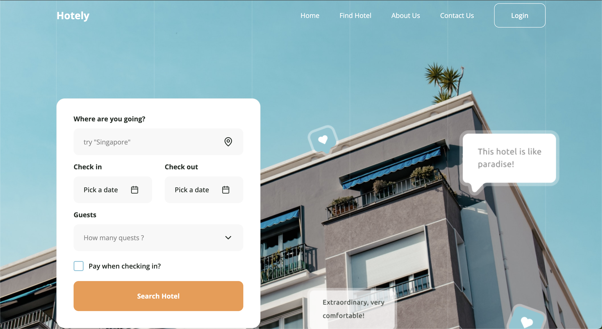
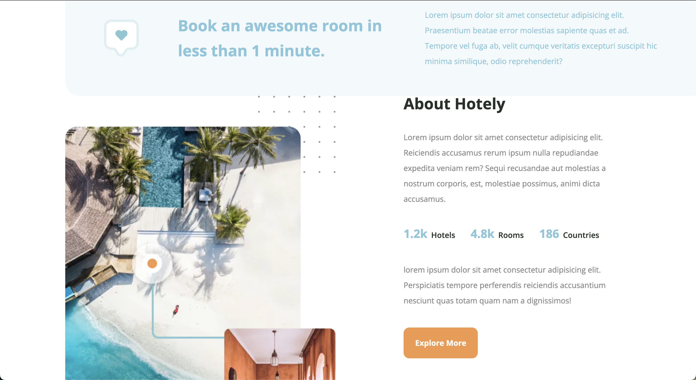
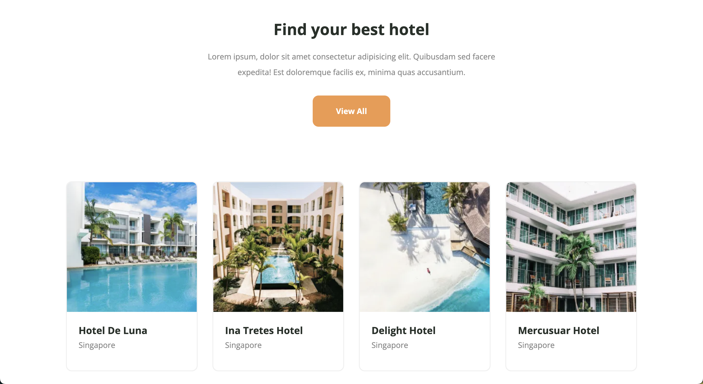
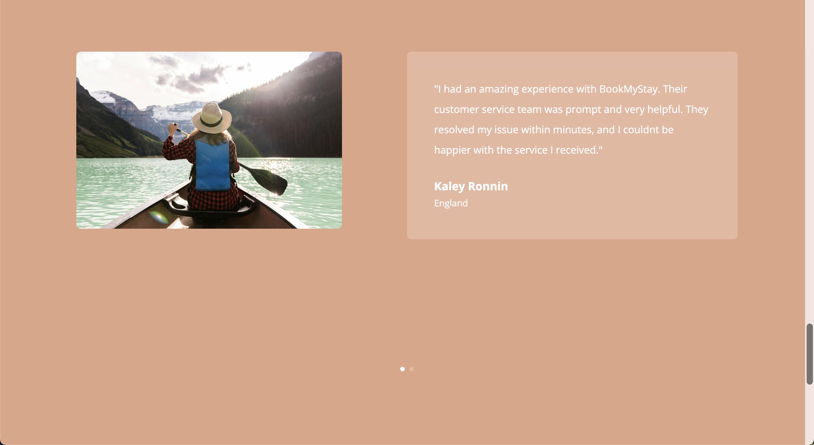
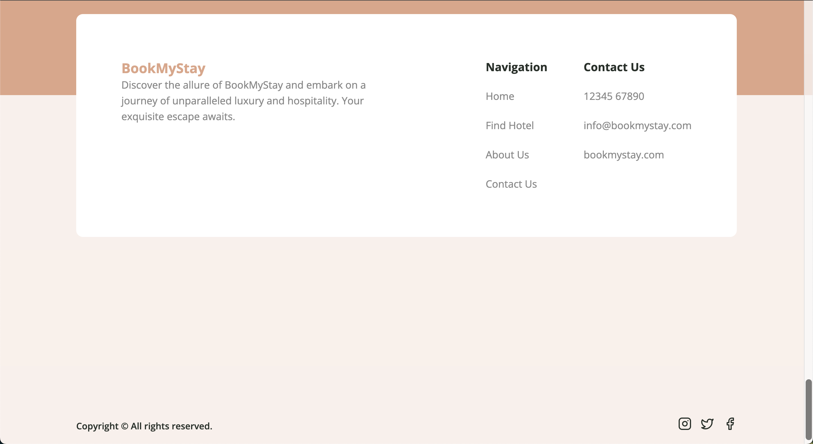

<h1>BookMyStay</h1>

<h2>About the project</h2>

  
BookMyStay is hotel booking website where user can book hotel around the world. At BookMyStay, we redefine the essence of opulence, offering an unparalleled fusion of sophistication and warmth. Nestled amidst breathtaking landscapes and iconic city scapes, our collection of exquisite accommodations promises an unforgettable retreat for every traveler.

👉 Live Demo: <a href='https://hotely-next.vercel.app/'>Live Demo</a>

<h3>Build with:</h3>

» Next js  
» Tailwind CSS  
» Shadcn ui

<h2>Screenshot</h2>
 

Homepage

About

Recommendation

Find Hotel

Testimonials

Contact

